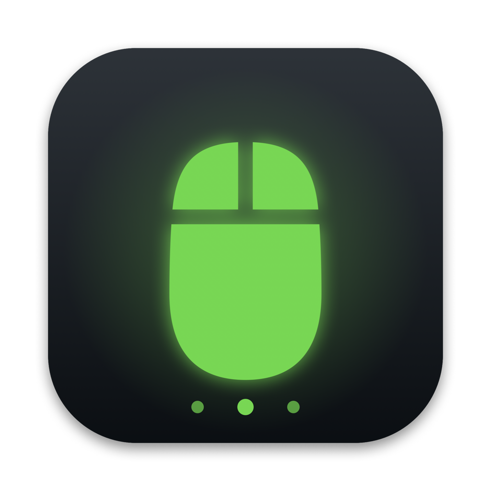
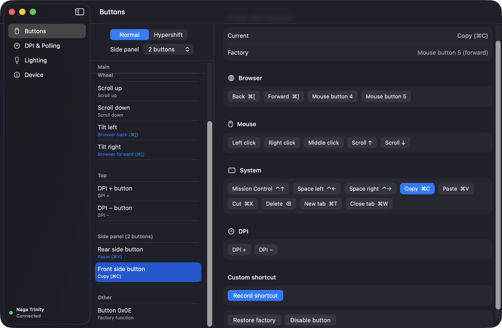
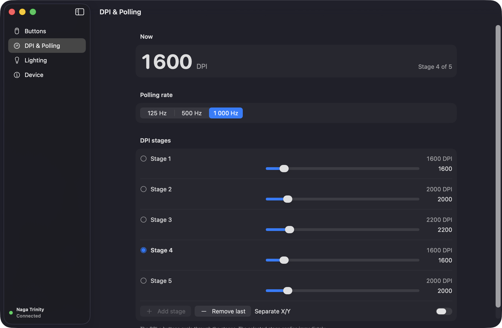
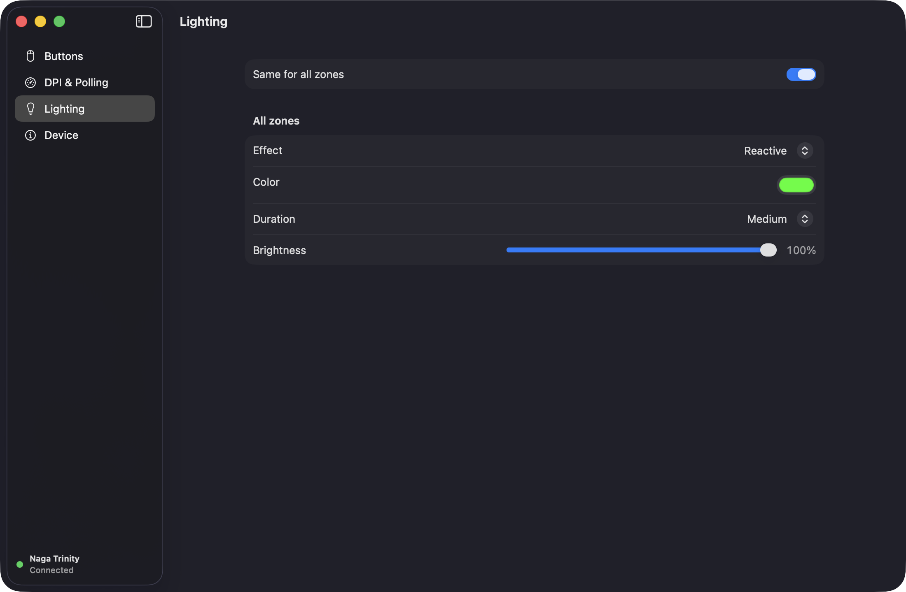

<p align="center">
  
</p>

<h1 align="center">Razer Control</h1>

<p align="center">
  Неофициальное нативное macOS-приложение для настройки <b>Razer Naga Trinity</b> — без Razer Synapse.
</p>

<p align="center">
  
  
  
  
</p>

<p align="center">
  <a href="README.md">English</a> · <b>Русский</b>
</p>

<p align="center">
  
</p>

## Зачем

Razer Synapse не поддерживает Naga Trinity на macOS. Razer Control общается с мышью напрямую, на её собственном протоколе: можно переназначать кнопки, настраивать DPI и подсветку. Все настройки записываются во **встроенную память мыши**, поэтому работают на любом компьютере, даже когда приложение не запущено.

## Возможности

**🖱 Переназначение кнопок**
- Любую кнопку можно превратить в клик мыши, сочетание клавиш (записывается одним нажатием) или DPI ±
- Пресеты в один клик: назад/вперёд в браузере, копировать/вставить/вырезать, Mission Control, переключение рабочих столов, вкладки
- Наклон колеса влево/вправо, верхние кнопки DPI, все три боковые панели (2, 7 и 12 кнопок)
- Два слоя: обычный и **Hypershift**
- Возврат любой кнопки к заводскому действию

**🎯 DPI и частота опроса**
- До 5 стадий DPI от 100 до 16 000, можно раздельно по X/Y
- Текущий DPI виден вживую и обновляется, когда нажимаешь кнопки DPI на мыши
- Частота опроса: 125 / 500 / 1000 Гц

**🌈 Подсветка**
- Три зоны: колесо, логотип и боковая панель. Можно все вместе или каждую отдельно
- Статичный цвет, дыхание (один, два или случайные цвета), спектр, реакция на нажатие
- Яркость для каждой зоны
- **Программные анимации** с регулируемой скоростью и палитрой до 8 цветов: дыхание, смена цветов, радуга, волна, стробоскоп, сердцебиение, огонь, нагрузка CPU. Работают, пока открыто приложение.

**🌍 Интерфейс на 7 языках:** English, русский, українська, Deutsch, Español, Français, 简体中文

<table>
  <tr>
    <td></td>
    <td></td>
  </tr>
</table>

## Установка

Готовой сборки пока нет. Сборка занимает около минуты.

**Нужно:** macOS 14 Sonoma или новее и Xcode 15+ (или Command Line Tools со Swift 5.10+).

```sh
git clone git@github.com:metlnt/razer-macos.git
cd razer-macos
./build-app.sh
open build/RazerControl.app
```

Чтобы приложение осталось насовсем, перетащите `build/RazerControl.app` в «Программы».

С мышью приложение общается USB control-запросами (`IOUSBHost`). Разрешения «Мониторинг ввода» и «Универсальный доступ» ему **не нужны**.

## Вопросы и ответы

<details>
<summary><b>Приложение должно быть постоянно запущено?</b></summary>

Нет. Все настройки хранятся в самой мыши. Открывайте приложение, только когда нужно что-то поменять.
</details>

<details>
<summary><b>Работает с другими мышами Razer?</b></summary>

Пока нет. Поддерживается только Naga Trinity (USB `1532:0067`). Протокол у мышей Razer похожий, но ID кнопок и зоны подсветки отличаются. Pull request'ы приветствуются, а начать стоит с <a href="CAPABILITIES.md">CAPABILITIES.md</a>.
</details>

<details>
<summary><b>Как вернуть заводские настройки?</b></summary>

Для одной кнопки нажмите <b>«Вернуть заводское»</b>. Для всех сразу — <b>«Устройство» → «Сбросить все кнопки к заводским»</b>. Заводские назначения также сохранены в <a href="backup-original.json">backup-original.json</a>.
</details>

<details>
<summary><b>Как сменить язык приложения?</b></summary>

Приложение следует языку системы. Чтобы выбрать другой язык только для него, откройте <b>Системные настройки → Основные → Язык и регион → Приложения</b>.
</details>

<details>
<summary><b>Что такое Hypershift?</b></summary>

Это второй слой назначений, как клавиша Fn. Пока зажата кнопка Hypershift, остальные кнопки выполняют альтернативные действия.
</details>

## Как это устроено

Naga Trinity принимает 90-байтные HID feature report'ы на интерфейсе 0: класс команды, ID, аргументы и XOR-контрольная сумма. Приложение отправляет их как HID-запросы `SET_REPORT`/`GET_REPORT` по управляющему каналу.

| Путь | Что там |
|---|---|
| `NagaControl/Sources/NagaKit` | протокол: формат отчётов, команды DPI, подсветки и кнопок, таблица клавиш |
| `NagaControl/Sources/NagaControl` | SwiftUI-интерфейс |
| `NagaControl/Localization` | `translations.py` — единственный источник всех переводов |
| `CAPABILITIES.md` | расшифровка команд протокола |
| `razer_proto.py` | Python-версия протокола для экспериментов (`pip install hidapi`) |

### Как добавить перевод

1. Добавьте колонку в `T` в `NagaControl/Localization/translations.py`, а код языка — в `LANGS`.
2. Запустите `python3 NagaControl/Localization/translations.py`.
3. Добавьте код языка в `CFBundleLocalizations` в `build-app.sh`.

> [!WARNING]
> Прошивка принимает любые команды класса `0x06`, а `06:8D` подвешивает управляющий интерфейс мыши до переподключения. Приложение их никогда не отправляет. Учитывайте это, если экспериментируете с `razer_proto.py`.

## Отказ от ответственности

Неофициальный проект, не связан с Razer Inc. и не одобрен ею. «Razer» и «Naga» — товарные знаки Razer Inc. Используете на свой страх и риск.
